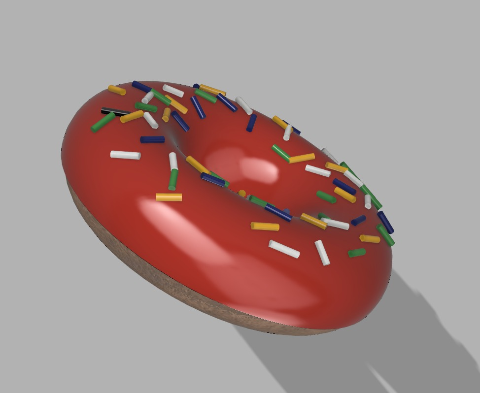
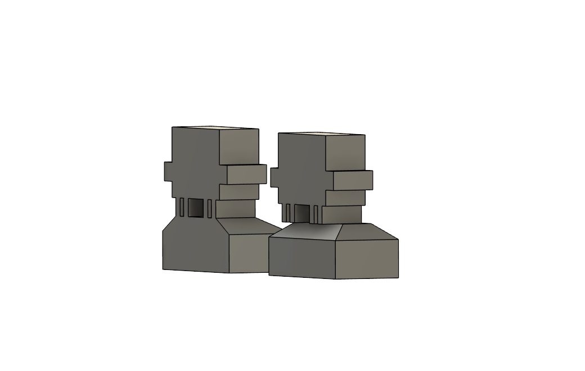

# FusionHelper

**Fusion 360 will happily build geometry that is wrong — and tell you nothing.
FusionHelper makes an AI's CAD errors either impossible to express or
impossible to miss.**

<p align="center">
  
  <br/>
  <em>Designed by Claude through FusionHelper from 25+ reference photos — 62 bodies,
  9 live parameters, every check green. Coloured and rendered in Fusion.</em>
</p>

## The problem, measured

We built the same bracket twice in a live Fusion 360: once the way an LLM
naturally writes it (raw coordinates), once with named parameters and datums.
Identical at build time. Then one parameter changed:

> The raw-coordinate bracket ended **40 mm off the plate edge and 8 mm embedded
> in the plate. Fusion reported zero errors.**

Silence is the failure mode. Everything here exists to break it.

## What ships

A **Claude Code skill** and a small **Python library**. No MCP server —
Autodesk ships one inside Fusion, and it works.

| Piece | Job |
|---|---|
| `skills/fusion-design/` | The discipline, resident all session: parameters first, named datums, eleven standing rules — each traceable to a live probe |
| `skills/print-in-place-design/` | The mechanism layer: clearance tables, capture primitives, gear-train and raised-decor rules that decide whether a printed mechanism frees itself or welds solid |
| `fusionhelper.preflight` | Offline gate, ~1 s: pyright vs Autodesk's own API stubs + lint rules. Catches hallucinated calls **before Fusion sees them** — 7/7 in measurement, 0 false positives |
| `fusionhelper.verify` | A block appended to every script: constraints, timeline health, interference, clearances, and parameter **liveness** — the only check that catches a model that *looks* parametric and is silently dead |
| `fusionhelper.buildkit` + `fusionhelper.bundle` | One canonical copy of the helpers every build script used to copy-paste; the bundler inlines the kit and appends the verify stub so a single self-contained, gated artifact reaches Fusion |

The gate cannot fail open: a known-bad canary rides along on every run, and a
gate that stops working reports `GATE_BROKEN`, never `PASS`.

## Quick start

```bash
pip install -e .
python -c "from fusionhelper import verify; verify.install_block()"

# generate a script, then:
python -m fusionhelper.preflight box.py   # exit 0 → send to Fusion

# scripts that import the buildkit go through the bundler first:
python -m fusionhelper.bundle box.py            # writes box.bundled.py
python -m fusionhelper.preflight box.bundled.py # gate the artifact, send it
```

Exit 0: send it. Exit 1: fix the script — findings cite rule numbers. Exit 3:
fix the machine, the script is fine.

## Receipts

- **Trophy duplicate** — an existing hand-built model rebuilt from scratch,
  fully parametric: 22 named parameters, liveness pass on all of them,
  volume within 0.38 % of the original.

  

- **The donut above** — stylised-organic subject, semi-random sprinkles that
  stay seated on the icing under any resize, interference-verified across all
  62 bodies. Halving the icing thickness afterwards was **one parameter edit**.
- **The fidget-spinner programme** — ten print-in-place designs built
  end-to-end through the pipeline, one physically printed and spinning
  (Supernova 72: plate-referenced rollers came off the plate free, no
  break-in). The flagship, Orrery mk3, is a five-stage coaxial gear train —
  housing, five outer planets, a double-toothed ring flywheel, five inner
  planets and a free-floating sun, every stage standing on the build plate —
  with engraved-scrollwork decor generated procedurally and validated
  offline before a line of it reached Fusion. Interference: PASS across all
  20 mesh pairs, after the checks isolated two real tooth-geometry bugs that
  three plausible fixes had survived. The whole model rebuilds from
  [one idempotent script](artifacts/spinner-scripts/or3_build.py); the story
  and the measured traps live in
  [`docs/fidget-spinner-handoff.md`](docs/fidget-spinner-handoff.md).
- **P1–P8** — the eight probes that decided the architecture run as a live
  regression suite against a real Fusion install, asserting on parsed JSON,
  never prose.

## Honest limits

Every check verifies the model against what was *declared*. A green verdict
means: built correctly, stays editable, matches the stated numbers. Whether it
is the part you *wanted* is judged by a human, from renders. We say it that
way on purpose.

## Docs

Start at [`docs/README.md`](docs/README.md) — design, evidence base, verified
API notes (the traps: the XZ inversion, the fail-open pyright config, stub
gaps, timeline rollback semantics), and the implementation plan. The
fidget-spinner programme has its own trail: research corpus, a 30-model
competitor teardown, consolidated design lessons, and the handoff doc that
carries every measured gotcha forward.

**Status:** Phase 1 (the gate) complete and live-validated, plus the buildkit
and bundler. Phase 2 adds the declaration block and dimensional-chain
checking.
